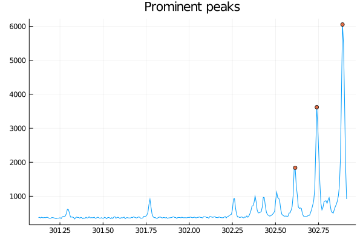
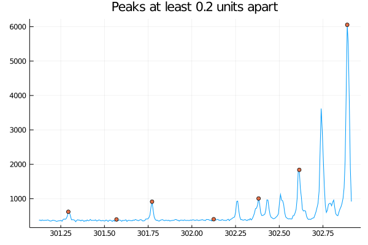

# `Findpeaks`

`findpeaks` function is inspired by MATLAB's findpeaks function.

The function allows you to get positions of local maxima of one-dimensional data.
Since real-world data are often noisy, there is usually a large number of local maxima that are of no interest.

`findpeaks` offers filtering based on 4 parameters (can be combined):
* peak height
* distance between peaks
* peak [prominence](https://en.wikipedia.org/wiki/Topographic_prominence)
* threshold - minimal difference between neighboring data points

```@docs
findpeaks
```

# Example

```julia
using Findpeaks

using DelimitedFiles

using Plots
default(legend=false)


data = readdlm("test/data/findpeaks_example_spectrum.txt")
x = data[:, 1]
y = data[:, 2]

peaks = findpeaks(y, x, min_prom=1000.)

plot(x, y, title="Prominent peaks")
scatter!(x[peaks], y[peaks])
```



```julia
sep = 0.2

peaks = findpeaks(y, x, min_dist=sep)

plot(x, y, title="Peaks at least $sep units apart")
scatter!(x[peaks], y[peaks])
```



